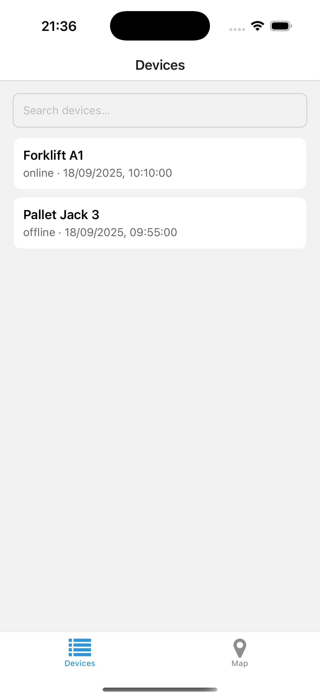
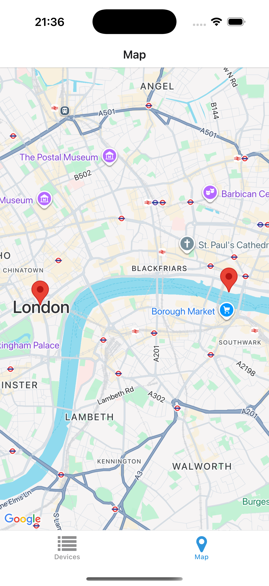
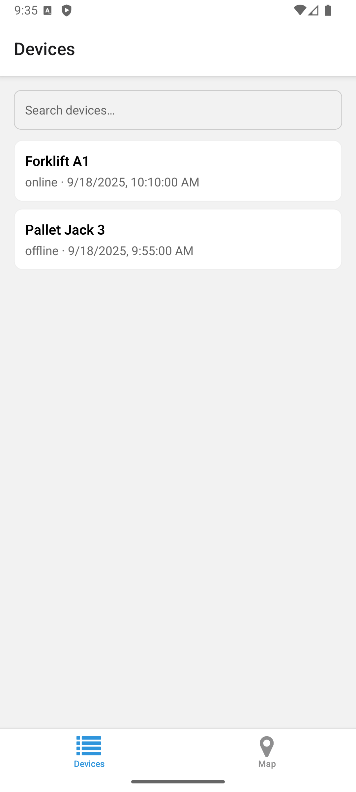
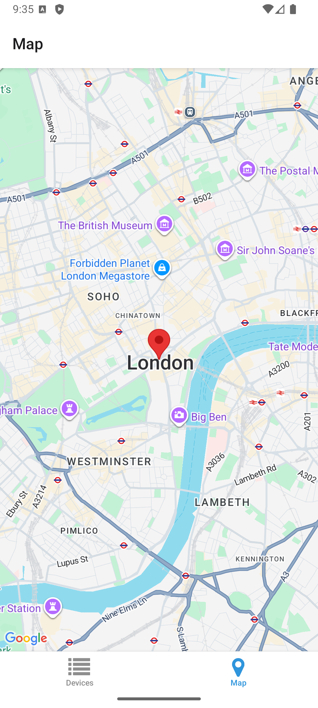

# Device Locator (Expo)

Prototype mobile app using Expo Router + React Native Maps.  
Lists devices, shows details, and displays their locations on a map.

## Features

- Devices list with search
- Device detail (status + last seen + open in Maps)
- Map with Google markers
- Runs on iOS + Android

## Screenshots

### iOS

Devices | Map
:---:|:---:
 | 

### Android

Devices | Map
:---:|:---:
 | 

## Quickstart

```bash
npm install
npx expo start
